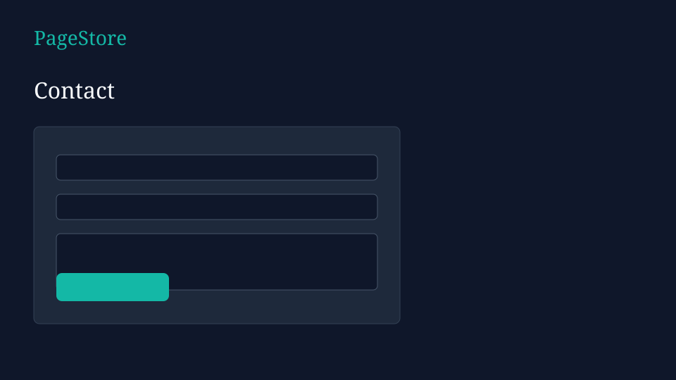

# PageStore — Fashion for Everyone

Django-served fashion storefront: categories, shop filters, local cart badge, and contact — affordable, stylish, accessible.

| | |
|---|---|
| **Live demo** | *[Add Render / Railway URL after deploy]* |
| **Repo** | [github.com/Kamo2330/PageStore](https://github.com/Kamo2330/PageStore) |
| **License** | [MIT](LICENSE) |

---

## Problem it solves

Small fashion brands often launch with Instagram-only selling and no clear catalog or filterable shop. **PageStore** shows a clean storefront flow: browse categories, filter products, keep a client-side cart, and reach the brand via contact — all in one responsive Django site.

---

## What I built

Solo-built product UI + Django wiring:

- Multi-page store experience (home, shop, about, contact)
- Featured categories and new-arrivals style product cards
- Shop filters (search, size, gender, category, color, price)
- Client-side cart badge via `localStorage` (`store/js/main.js`)
- Django project that serves pages, static assets, and admin entrypoint
- Environment-based settings, WhiteNoise-ready static files, Render blueprint
- Smoke tests for every public route

---

## Tech stack

| Layer | Choice |
|-------|--------|
| Backend | Python, Django 5 |
| Frontend | HTML, CSS, vanilla JavaScript |
| Database | SQLite (local only; not committed) |
| Static files | WhiteNoise |
| Deploy | Render / Railway / any WSGI host (Gunicorn) |

> For a stronger full-stack portfolio piece, see **Qasha** or **Camp** (Next.js + Django REST + PostgreSQL). This repo keeps the original PageStore fashion UX.

---

## Features

- Home hero + featured categories (Men, Women, Kids, Accessories)
- Shop page with GET filters (search, size, gender, category, color, price)
- About and Contact pages
- Sticky header with active nav states
- Local cart count badge (browser `localStorage`)
- Responsive layout shared via `store/base.html`

---

## Screenshots

| Home | Shop | Contact |
|:---:|:---:|:---:|
|  |  |  |

Replace these SVG placeholders with real PNG captures from `http://127.0.0.1:8000/` when you can.

---

## Setup instructions

### Prerequisites

- Python 3.11+

### Install and run

```bash
git clone https://github.com/Kamo2330/PageStore.git
cd PageStore

python -m venv .venv

# Windows
.venv\Scripts\activate

# macOS / Linux
# source .venv/bin/activate

pip install -r requirements.txt
copy .env.example .env          # Windows
# cp .env.example .env          # macOS / Linux

python manage.py migrate
python manage.py runserver
```

Open the URL printed by `runserver` (on many Windows PCs **8000 is reserved**, so it may be **http://127.0.0.1:7000/** or **http://127.0.0.1:9000/**).  
Shop: add `/shop/` to that URL.

No Docker is required. The site uses SQLite locally.

---

## Environment variables

Copy `.env.example` → `.env`:

| Variable | Purpose | Example |
|----------|---------|---------|
| `SECRET_KEY` | Django secret (required in production) | random long string |
| `DEBUG` | Debug mode | `True` locally / `False` on Render |
| `ALLOWED_HOSTS` | Hostnames allowed to serve the app | `localhost,127.0.0.1,your-app.onrender.com` |

Optional UI tweaks (in code, not env):

- Styles: `store/static/store/css/styles.css`
- Cart logic: `store/static/store/js/main.js`
- Product / hero imagery: `store/templates/store/`

---

## Running tests

```bash
python manage.py test store
```

---

## Deployment

### Render

1. Connect this GitHub repo in [Render](https://render.com)
2. Use `render.yaml`, or create a **Web Service**:
   - **Build:** `pip install -r requirements.txt && python manage.py collectstatic --noinput`
   - **Start:** `gunicorn PageStore.wsgi --bind 0.0.0.0:$PORT`
3. Set `SECRET_KEY`, `DEBUG=False`, `ALLOWED_HOSTS=your-service.onrender.com`
4. Paste the live URL into the table at the top of this README

### Railway / Fly.io

Same build/start commands. Set the same environment variables.

---

## Project structure

```
PageStore/
├── PageStore/            # Django project (settings, urls, wsgi)
├── store/                # App (views, urls, templates, static, tests)
├── docs/screenshots/     # README screenshot placeholders
├── .env.example
├── requirements.txt
├── render.yaml
├── LICENSE
└── README.md
```

---

**PageStore** — Affordable · Stylish · Accessible
